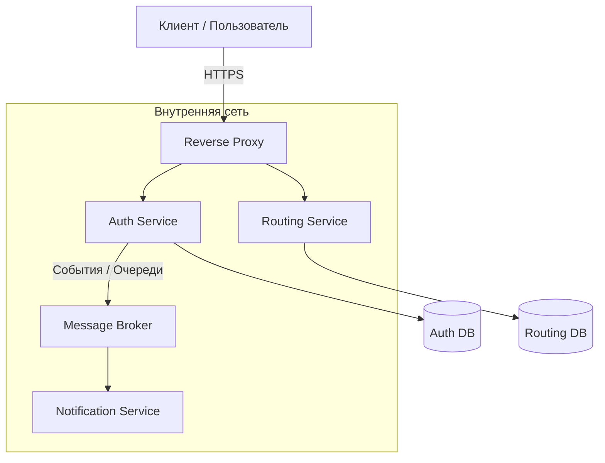
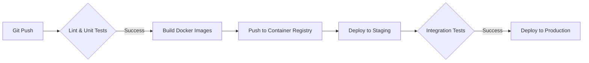

# pet-project-mono-repo

```mermaid
graph TD
    Client[Клиент / Пользователь] -->|HTTPS| RP[Reverse Proxy]
    RP --> Auth[Auth Service]
    RP --> Route[Routing Service]
    
    Auth --> DB_Auth[(Auth DB)]
    Route --> DB_Route[(Routing DB)]
    
    Auth -->|События / Очереди| MQ[Message Broker]
    MQ --> Notif[Notification Service]
    
    subgraph "Внутренняя сеть"
        RP
        Auth
        Route
        MQ
        Notif
    end
```

```mermaid
graph LR
    A[Git Push] --> B{Lint & Unit Tests}
    B -->|Success| C[Build Docker Images]
    C --> D[Push to Container Registry]
    D --> E[Deploy to Staging]
    E --> F{Integration Tests}
    F -->|Success| G[Deploy to Production]
```
